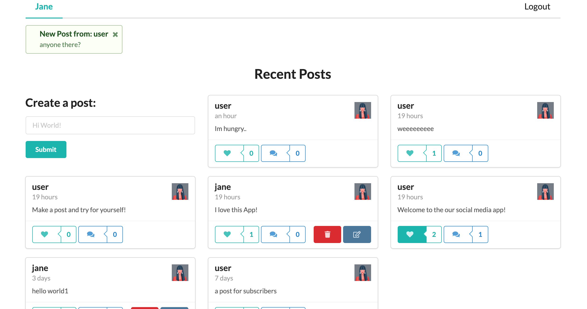
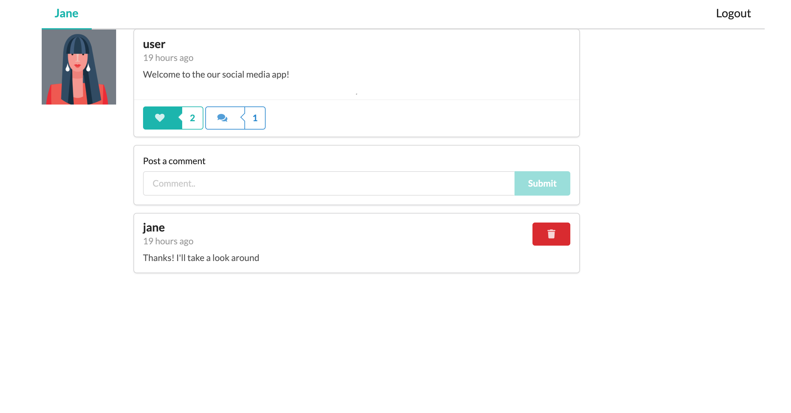

# React SocialMeds App

## Technologies Used
React.js / Graphql / Apollo server / Mongodb / Javascript / Node / SemanticUI-React

## Project Description 
Allows users to see others users posts and login/register to create posts. Ability to Create/Read/Update/Delete Posts.  Also allows users to comment and like posts.  Additionally websockets are used to provide real time notifications new posts. Requests and endpoints are done via Graphql.

## Quickstart

`cd client npm start`

`npm start`

** Check out the live app on [Heroku](https://react-socialmeds-client.herokuapp.com/)

